# MiniAxe build guide

[To people who purchased at Ten-key Vol.1](tenkey_vol1_en.md)

## Before build
* Please be aware of injuries with soldering irons, tools, parts etc.
* When you leave your seat during work, please confirm that the soldering iron is turned off.
* Very small parts are included, so be careful not to lose any.

## Confirm contents
The following parts are included in the kit. Please check whether there is any shortage before work.

The soldered kit includes only the part number (13) and later, so please check.


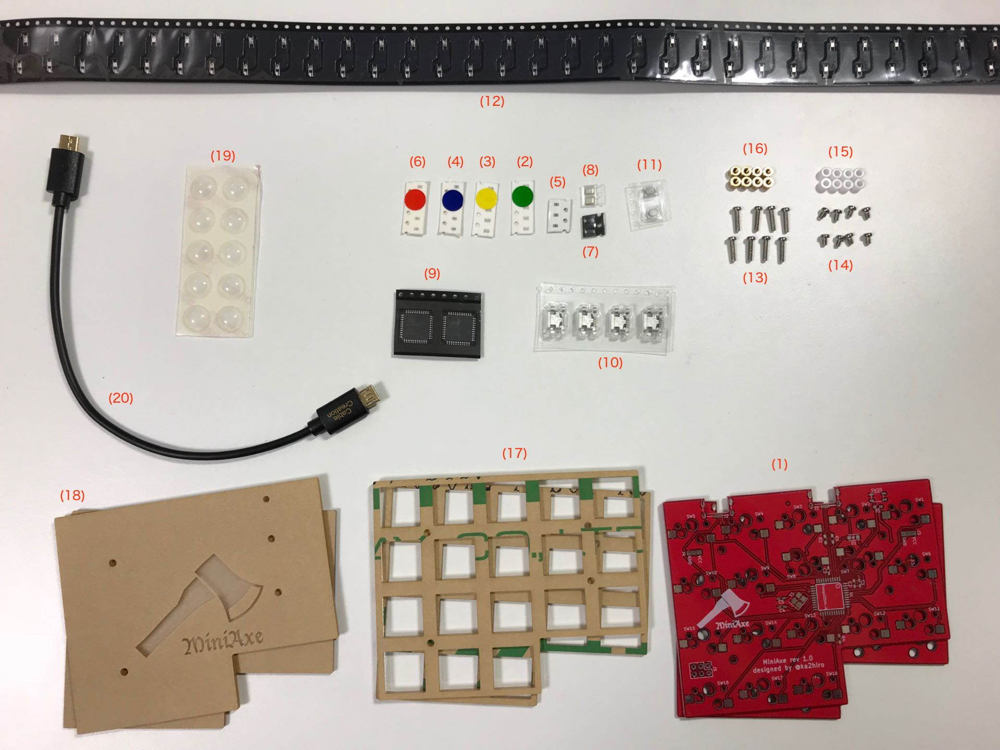

Number | Name | Value | Qty | Remarks | Place
:----|:--------|:-----|:----|:-----------------|:-------
1 | PCB | | 2 | 1 for left hand, 1 for right hand |
2 | Resistor | 10 kΩ | 5 | 1 spare, colored with green sticker or marker on tape package<sup>[1](#marker)</sup>. Marked "103" on the component. | R1, R4
3 | Resistor | 22 Ω | 5 | 1 spare, colored with yellow sticker or marker on tape package<sup>[1](#marker)</sup>. Marked "220" on the component. | R2, R3
4 | Capacitor | 1 μF | 5 | 1 spare, colored with blue sticker or marker on tape package<sup>[1](#marker)</sup>. | C1, C3
5 | Capacitor | 0.1 μF | 3 | 1 spare, no sticker or marker. | C2
6 | Capacitor | 22pF | 5 | 1 spare, colored with red sticker or marker on tape package<sup>[1](#marker)</sup> | C4, C5
7 | Schottky diode | | 2 | | D1
8 | Crystal oscillator | 16 MHz | 2 | | Y1
9 | MPU | ATMEGA 32 U 4 | 2 | | U1
10 | USB connector | Micro B female | 4 | | J1, J2
11 | Tact switch | | 2 | | SW20
12 | Switch socket | | 36 | | SW1 - SW18
13 | M2 screw | 8 mm | 8 |
14 | M2 screw <sup>[2](#screw)</sup> | 4 mm | 8 |
15 | M2 resin standoff | 3 mm | 8 |
16 | M2 Metal standoff <sup>[3](#metal_spacer)</sup> | 3.5 mm | 8 |
17 | Top plate | | 2 |
18 | Bottom plate | | 2 |
19 | Rubber feet | | 10 |
20 | USB cable | | 1 | Connect between left and right. |

## Other required items
In order to complete the kit, the following parts must be prepared separately.

* Key switch (CherryMX compatible only support. Low-profile type is not supported)
* Key caps
* USB Micro B cable (for connection with PC)

## Required tools
In order to build, the following tools are required at minimum.

* Soldering iron (preferred temperature controllable)
* Lead solder
* Tweezers
* Phillips head screwdriver
* Magnifier
* Flux (Seriously. Fine-pitch SMD soldering is no fun without flux.)

In addition, you may also prepare the following as necessary.

* Flux remover
* Solder wick
* Multimeter


# Buid procedure

For the soldered kit, proceed with building from the item [Verify that it is recognized as a USB device](#verify-that-it-is-recognized-as-a-usb-device).


## Solder MPUs
1. Place the ● mark (pin 1 marking) on the MPU aligned with the ○ mark on the board.
2. Make sure that all pins are on the pad and solder them.

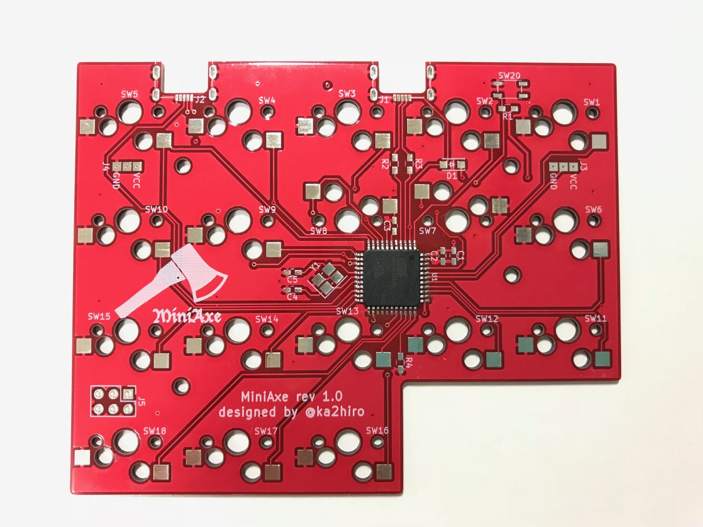

For the QFP package soldering, this [video](https://youtu.be/b9FC9fAlfQE?t=1172) may be helpful.

## Solder crystal oscilators
1. Align the long side of the crystal oscillator (which may be either long side) so that it sits parallel with the Y1 marking on the board and place it at the center of the four pads.
2. Since only a little bit of the PCB pads can be seen at the corners of the crystal oscillator, apply solder while warming the corners of the crystal.

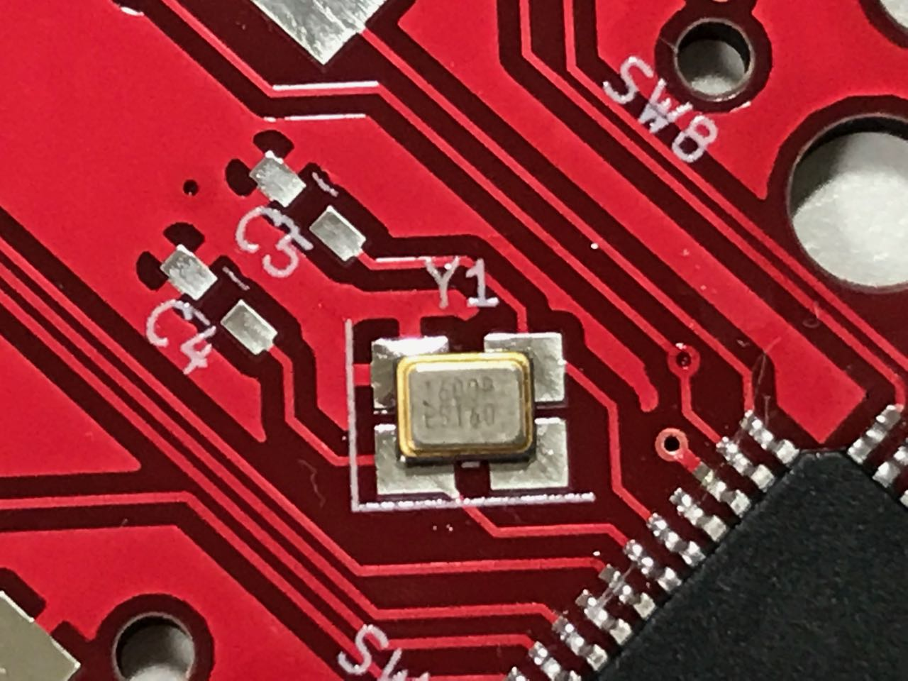

This [video](https://www.youtube.com/watch?v=14fJTgFg03M) may be helpful for soldering SMD crystal oscillator.

## Solder resistors
1. SMD resistors and capacitors are very small and are easy to lose. During assembly, completely solder one component before removing the next one from the tape.

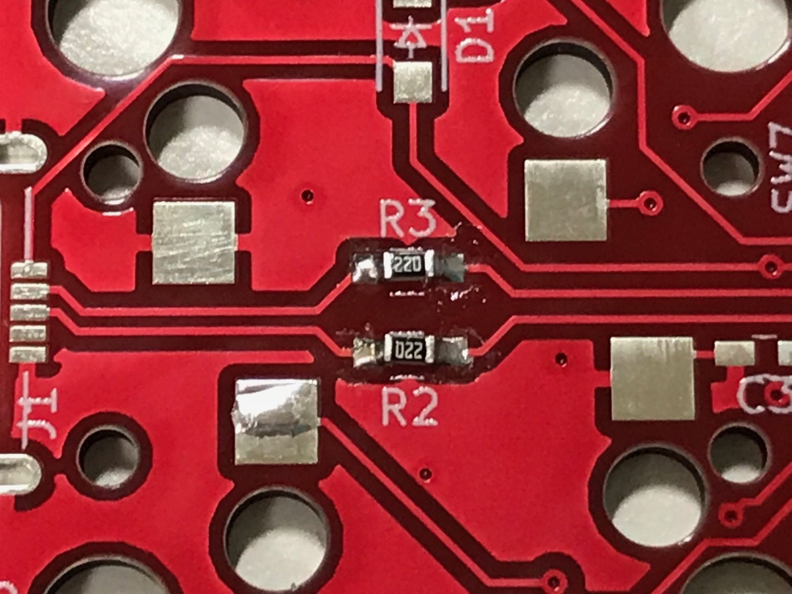

## Solder capacitors
1. The included capacitors do not have values printed on them. Be careful. 

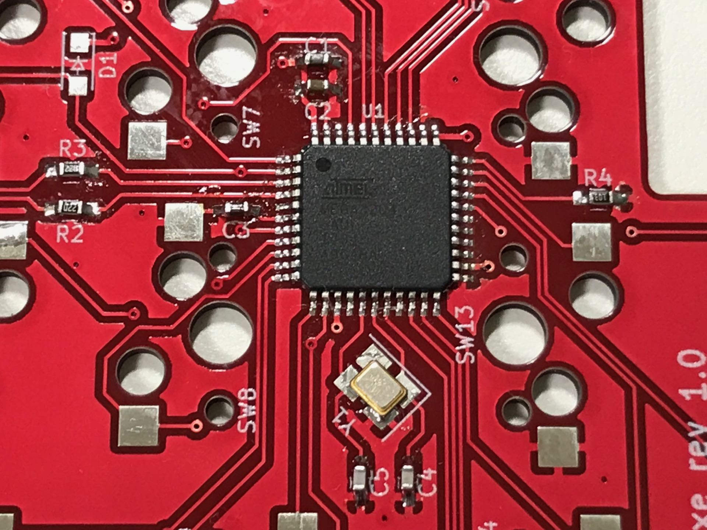

## Solder schottky diodes
1. The diode must be installed in the correct orientation. Align the part so that the white band is on the same side as the vertical bar of the diode symbol on the board.


## Solder USB connectors
1. Solder the 5 central pins first, THEN the 4 outer tabs to ensure proper alignment.


## Solder tact switches
1. Since the tactile switch has a little metallic part on the side, heat that area with a soldering iron and let the solder flow.

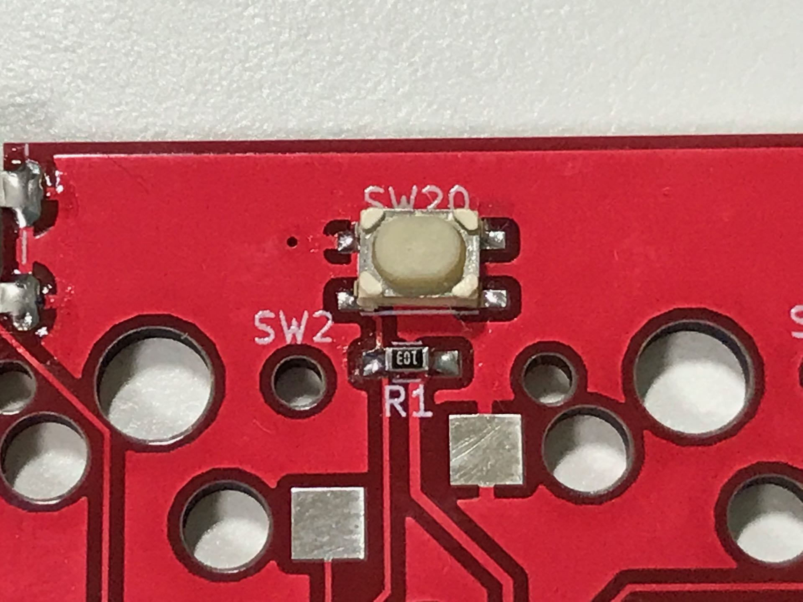

## Solder hotswap sockets
1. **CAUTION**  
   _There are 2 places (SW 7, SW 8) in the center of the PCB where the orientation of the socket is different from the others._  
   _If you install it in the wrong direction, the hole in the middle where the key switch is attached will be blocked._
2. Solder those two places first, check their orientation/placement, THEN solder the rest to avoid any issues.

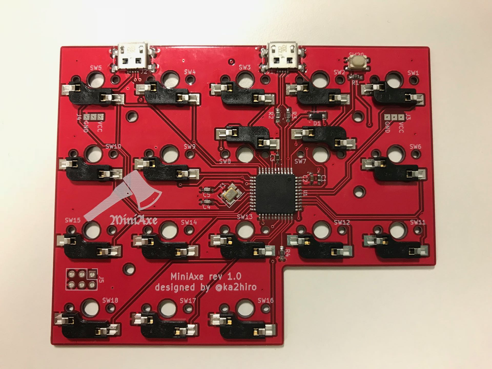

## Check whether the soldering is properly done
Refer to the schematic ([left side](files/MiniAxeLeft.pdf), [right side](files/MiniAxeRight.pdf)) and check whether soldering is correctly done.

Before connecting to the computer, at least check the following.

1. Check that there is no short circuit between UVCC - GND and VCC - GND.
2. Make sure the MPU pins are not bridged.
3. Make sure the USB connector pins are not bridged.

## Verify that it is recognized as a USB device  
1. Do not join the two sides of the keyboard yet.  
2. Insert a cable into the female microUSB port labeled J1 on one side of the keyboard only. Connect the other end of the cable to your computer.  
3. Confirm that it is recognized as a USB device. Unplug and repeat for the other side of the keyboard.  

* For Mac, start "System Information" and check whether the device named "ATm32U4DFU" is visible.
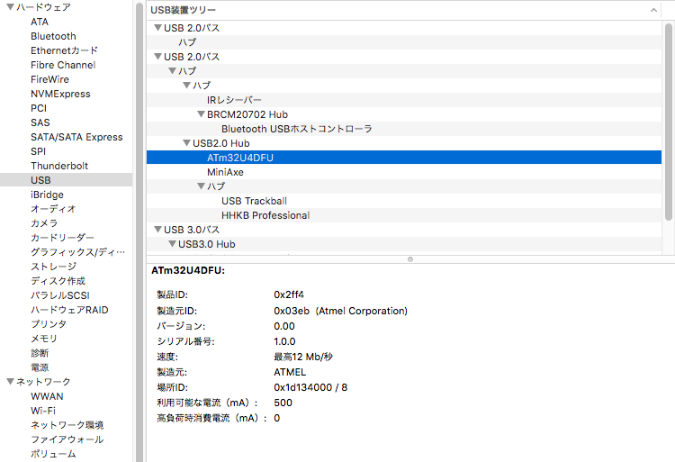

* For Windows, start "Device Manager" and under "libusb-win32 devices", check whether the device named "ATmega32U4" is visible.  
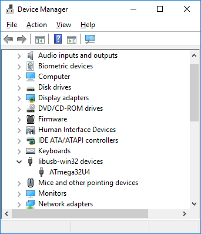

* For the soldered kit, make sure that "MiniAxe" is visible on Mac or Windows.

If it is not recognized as a USB device, please double check the schematic to see if all parts are properly soldered.

## Assemble the top plate

**The cut surface of the key switch hole on the top plate is tapered due to the characteristics of the laser cutter, so the size of the hole is slightly different on the front and back sides. Try mounting the key switch to be installed on the front and back sides of the top plate, and treat the side that is easier to mount as the front side.**

1. Insert M2 x 8 mm screws into the top plate and fix screws with a masking tape.
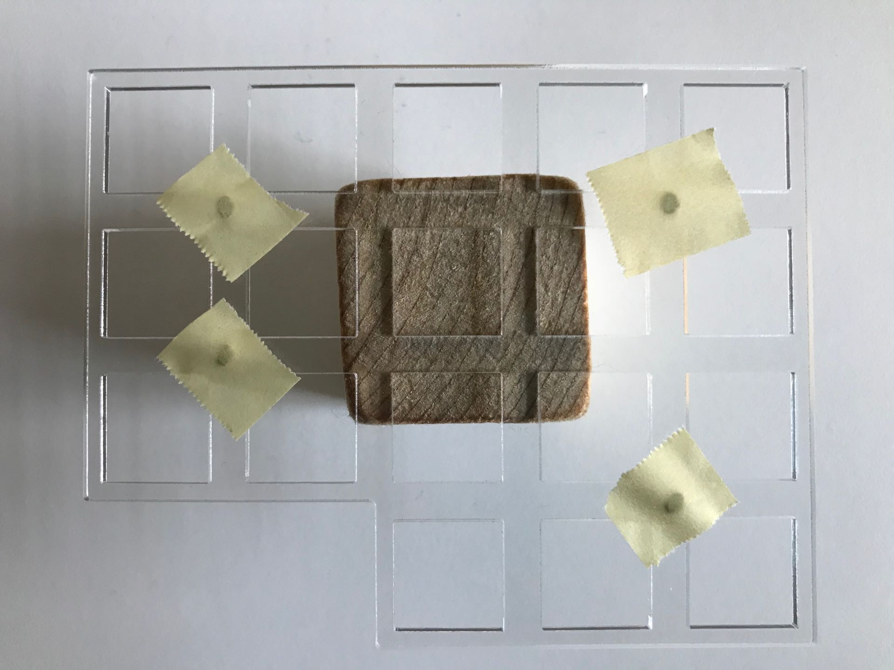
2. Turn the top plate over and attach resin standoffs.
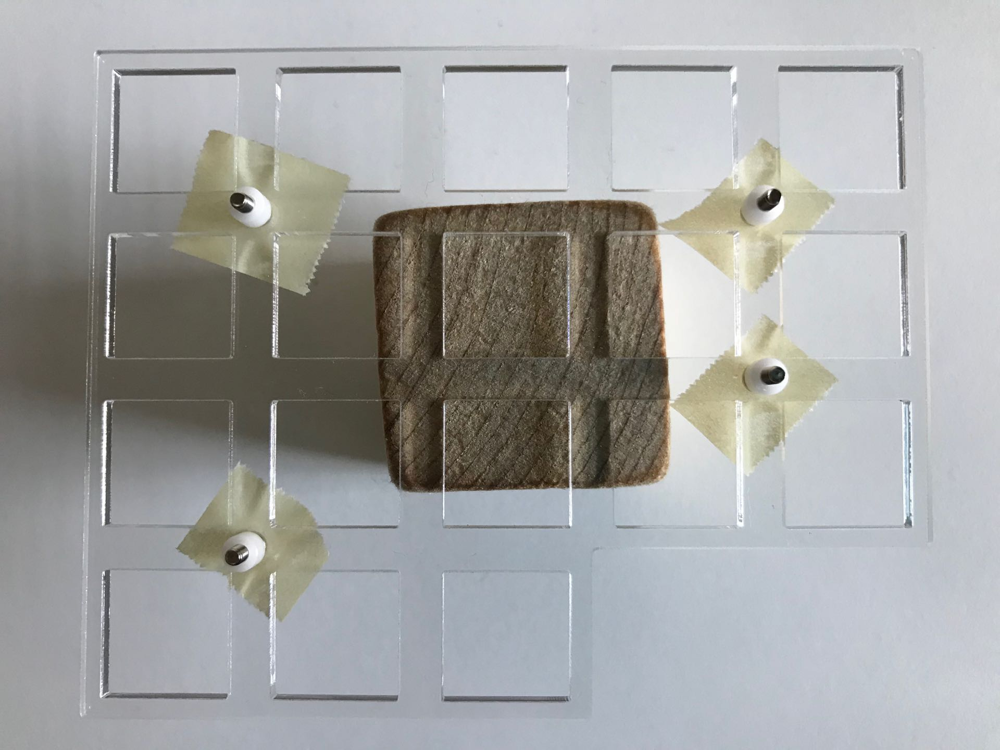
3. Combine with the PCB.
4. Attach metal standoffs to screws exposed on the PCB and tighten screws.
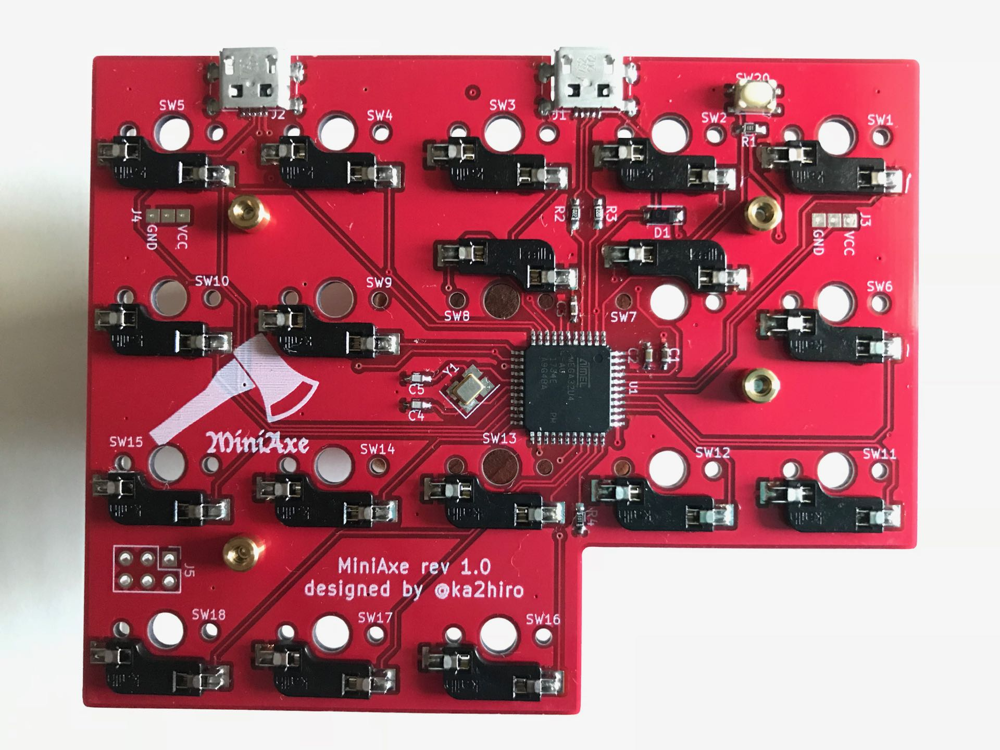

## Assemble the bottom plate
1. Insert an M3 x 3 mm screw into the bottom plate and turn a few times. Select the diagonally opposite screw and turn a few times (e.g. upper left → lower right → upper right → lower left etc.). Repeat until all screws are loosely attached. **Do not completely tighten the first screw and then do another one. Tighten evenly and gradually.**

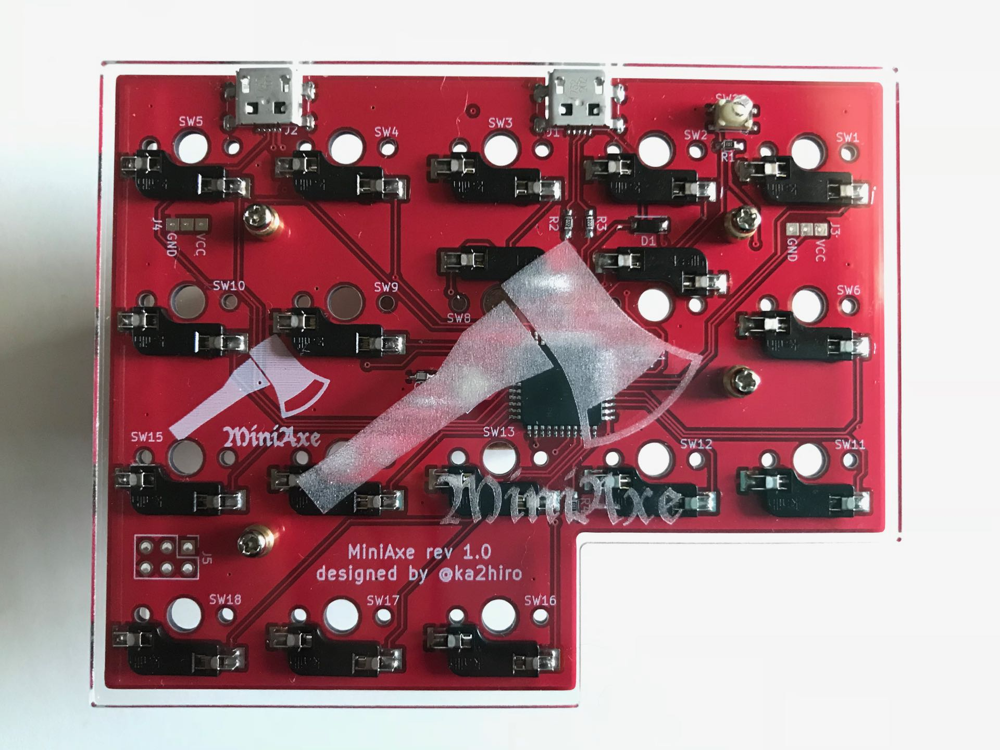

# Attach rubber feet
1. Attach the rubber feet on the bottom plate.
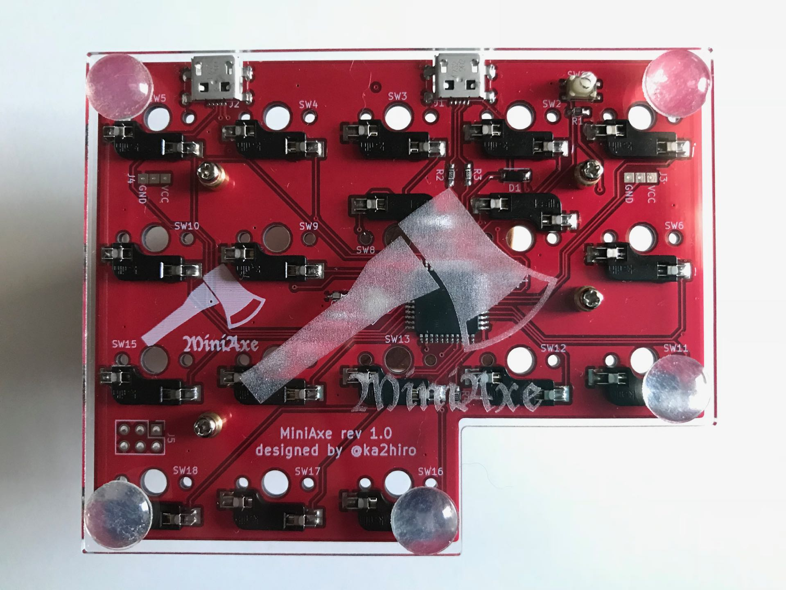

## Install key switches and caps, USB cables

**The cut surface of the key switch hole on the top plate is tapered due to the characteristics of the laser cutter, so the size of the hole is slightly different on the front and back sides. Try mounting the key switch to be installed on the front and back sides of the top plate, and treat the side that is easier to mount as the front side.**

1. Install the key switches and key caps of your choice.  
* Only Cherry MX-compatible switches are supported on this version of the MiniAxe. The "MiniAxe LP" supports low-profile switches.  
* If the keyswitch is difficult to install on the top plate, try changing the front and back sides of the top plate. Also, inserting something between the top plate and the board to support the top plate so that it does not bend can prevent the top plate from cracking. Install the top plate carefully without forcing it into place.
* Ensure key switch pins are straight before inserting. **Remember that SW7 and SW8 are oriented opposite to the others.**  
2. Join the two halves with the male-male microUSB cable. Connect the microUSB port J2 on one side to J2 on the other side.

## Write firmware

__For the pre-soldered kit, this step is not necessary since the default keymap has firmware has already been written.__

There are two ways to write firmware If you do not need to customize the firmware other than rewriting the keymap, the method using QMK Toolbox is easy and recommended.

### Writing firmware using the QMK Toolbox

1. Download and install the latest version of [QMK Toolbox](https://github.com/qmk/qmk_toolbox/releases).
    For Windows version, download either qmk_toolsbox.exe (application only) or qmk_toolbox_install.exe (installer included).
    For Mac, download either QMK.Toolbox.app.zip (application only) or QMK.Toolbox.pkg (installer included).

1. Download the MiniAxe firmware from the following link
    [miniaxe_via.hex](https://github.com/kagizaraya/miniaxe_build_guide/releases/download/remap/miniaxe_via.hex)

1. Start QMK Toolbox and drag & drop the firmware to "Local file" or click "Open" to specify the firmware file. Click "Open" to specify the firmware file. 
   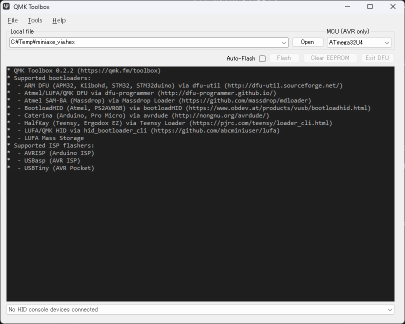

1. Connect the USB cable to the MiniAxe, press the reset switch to enter bootloader mode, and the QMK Toolbox will display the following.
    ```
    Atmel DFU device connected (libusb0): Atmel Corp. ATmega32U4 (03EB:2FF4:0000)
    ```

1. Click the "Flash" button in the QMK Toolbox to start writing.
    ```
    Attempting to flash, please don't remove device
    > dfu-programmer.exe atmega32u4 erase --force
    > Erasing flash...  Success
    > Checking memory from 0x0 to 0x6FFF...  Empty.
    > dfu-programmer.exe atmega32u4 flash --force "C:\Temp\miniaxe_via.hex"
    > 0% 100% Programming 0x4D00 bytes...
    > [>>>>>>>>>>>>>>>>>>>>>>>>>>>>>>>>] Success
    > 0% 100% Reading 0x7000 bytes...
    > [>>>>>>>>>>>>>>>>>>>>>>>>>>>>>>>>] Success
    > Validating...  Success
    > 0x4D00 bytes written into 0x7000 bytes memory (68.75%).
    > dfu-programmer.exe atmega32u4 reset
   ```

1. When the write completes, you will see the following: 
    ```
    Flash complete
    Atmel DFU device disconnected (libusb0): Atmel Corp.
    ```

1. Connect the USB cable to the other MiniAxe and write the firmware in the same way.

### Build QMK Firmware and write firmware

1. Clone the QMK repository.

    [qmk_firmware](https://github.com/qmk/qmk_firmware)

    If you want to use firmware for Remap, clone the following repository.
    [Kagizaraya's qmk_firmware](https://github.com/kagizaraya/qmk_remap)

1. After cloning, go to the directory of the local repository and execute the following command, then connect a keyboard as it will be waiting for the firmware to be written. If the keyboard is already connected, the writing will start directly.

    ~~~
    $ make miniaxe:default:dfu
    ~~~
    
    To build firmware for Remap, execute the following command.

    ~~~
    $ make miniaxe:via:dfu
    ~~~

    If you are writing firmware for the first time, you do not need to press the reset switch.

    Please refer to [this document](https://docs.qmk.fm/#/ja/newbs_getting_started) to build the environment to build the firmware.

## Rewrite keymap with Remap

If you are using firmware that supports Remap, you can rewrite the keymap using [Remap](https://remap-keys.app/).

Please refer to the following article for a very clear explanation of how to use Remap.

[Let's rewrite keymap using Remap (Beginner's Edition)](https://salicylic-acid3.hatenablog.com/entry/remap-manual)


## Completed!
Congratulations!

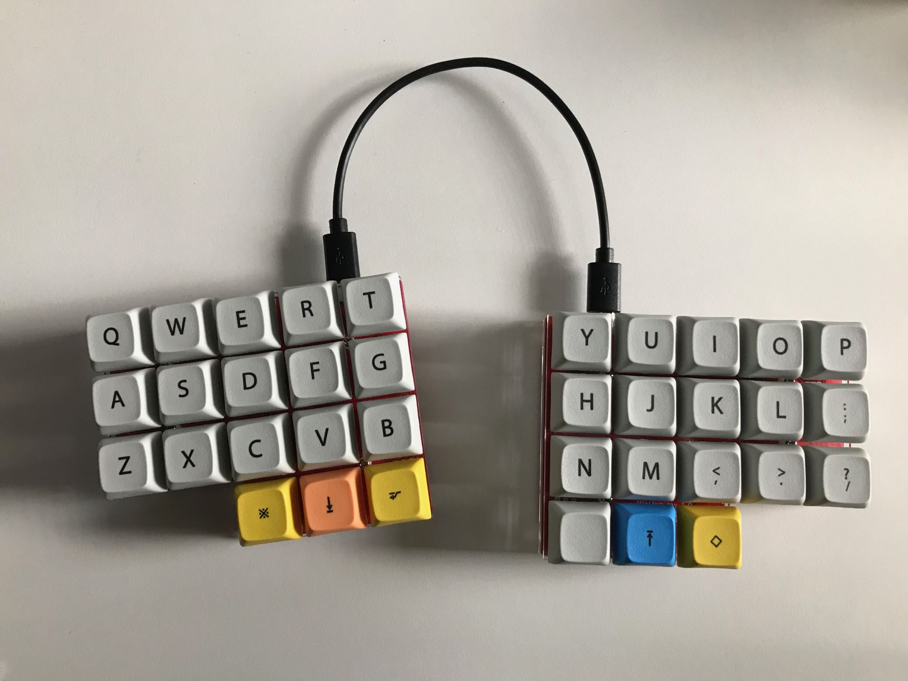

---
<a name="marker">1</a>: Some kits are colored with markers.  
<a name="screw">2</a>: In the Ten-key version M2 x 3 mm was included but it was changed to 4 mm.
<a name="metal_spacer">3</a>: Although the M2 metal standoff 3 mm was included in the Ten-key Vol.1 version, it was replaced by 3.5 mm.

